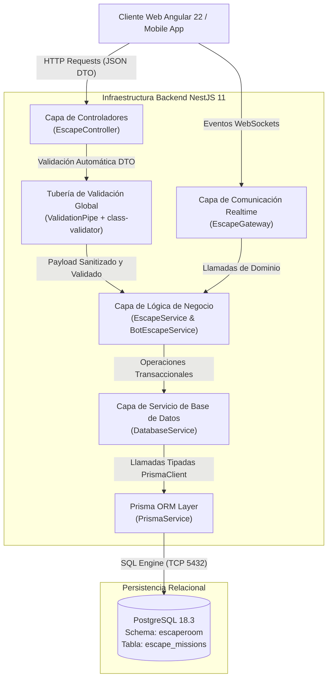
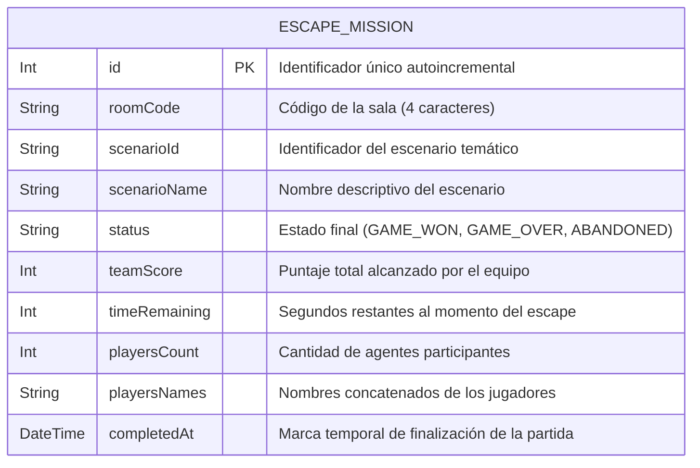

# UNIVERSIDAD MARIANO GÁLVEZ DE GUATEMALA
## FACULTAD DE INGENIERÍA EN SISTEMAS DE INFORMACIÓN Y CIENCIAS DE LA COMPUTACIÓN
### LICENCIATURA EN INGENIERÍA EN SISTEMAS DE INFORMACIÓN
### CURSO: DESARROLLO WEB — DÉCIMO SEMESTRE

---

<br>

<div align="center">

# SISTEMA DE ESCAPE ROOM DIGITAL COOPERATIVO EN TIEMPO REAL: ARQUITECTURA EN CAPAS CON CONTROLADORES, SERVICIOS DE NEGOCIO, DTOs Y PERSISTENCIA RELACIONAL EN NESTJS Y POSTGRESQL

<br>

**Autor:** Estudiante de Ingeniería en Sistemas de Información  
**Catedrático:** Catedrático del Curso de Desarrollo Web  
**Semestre:** Décimo Semestre, 2026  
**Guatemala, Septiembre de 2026**

</div>

<br>

---

## Resumen

El presente informe técnico-académico describe el análisis, diseño e implementación integral de la infraestructura backend para una plataforma de *Escape Room Digital Cooperativo Multijugador*. La solución tecnológica fue concebida bajo el paradigma de arquitectura empresarial en capas y desacoplamiento estricto, utilizando el framework **NestJS 11** sobre **Node.js** y el lenguaje tipado **TypeScript**. El núcleo del sistema implementa rigurosamente el patrón arquitectónico compuesto por **Controladores (Controllers)** para la gestión de solicitudes HTTP/REST y Swagger/OpenAPI, **Servicios de Negocio (Business Services)** para la gobernanza de las reglas y penalizaciones lógicas del juego, y **Objetos de Transferencia de Datos (DTOs)** con tuberías de validación automáticas en tiempo de ejecución sustentadas en `class-validator` y `class-transformer`. Asimismo, el sistema incorpora un canal de comunicación bidireccional de baja latencia mediante **WebSockets (`@WebSocketGateway`)** para la orquestación sincrónica de acertijos grupales, y una capa de persistencia relacional impulsada por el motor **PostgreSQL 18.3** a través del ORM tipado **Prisma**. El documento demuestra el consumo efectivo de la base de datos para la auditoría histórica de partidas y el cálculo dinámico de la tabla de clasificación (*Leaderboard*), cumpliendo con los estándares de calidad de software y documentación formal bajo las **Normas APA (7ma edición)**.

**Palabras clave:** *NestJS, Angular, Data Transfer Object (DTO), WebSockets, PostgreSQL, Prisma ORM, Arquitectura en Capas, Escape Room Digital.*

---

## Abstract

This academic and technical report details the analysis, architectural design, and software implementation of the backend infrastructure for a real-time *Collaborative Digital Escape Room* platform. The software solution was built upon an enterprise layered architecture pattern utilizing the **NestJS 11** framework powered by **Node.js** and **TypeScript**. The core system strictly implements an architectural decoupling comprising **Controllers** for handling RESTful endpoints and Swagger/OpenAPI documentation, **Business Services** to encapsulate game logic rules and time-penalty algorithms, and **Data Transfer Objects (DTOs)** with automatic runtime validation pipelines powered by `class-validator` and `class-transformer`. Furthermore, the application provides a bi-directional, low-latency communication layer using **WebSockets (`@WebSocketGateway`)** for multi-agent game state synchronization, and a relational persistence engine based on **PostgreSQL 18.3** orchestrated via **Prisma ORM**. Live persistence and operational queries are demonstrated through game auditing and real-time leaderboard generation, strictly adhering to modern software engineering standards and formal **APA 7th Edition** guidelines.

**Keywords:** *NestJS, Angular, Data Transfer Object (DTO), WebSockets, PostgreSQL, Prisma ORM, Layered Architecture, Digital Escape Room.*

---

## 1. Introducción

El auge de las aplicaciones interactivas en la web moderna exige una transición de arquitecturas monolíticas desacopladas hacia ecosistemas altamente tipados, tolerantes a fallos y capaces de coordinar estados asíncronos y transacciones relacionales en tiempo real. En el contexto pedagógico y formativo de la Universidad Mariano Gálvez de Guatemala, el desarrollo de software a nivel de décimo semestre requiere la puesta en práctica de patrones de diseño avanzados que garanticen mantenibilidad, seguridad en los datos de entrada y una clara separación de responsabilidades (*Separation of Concerns*).

El proyecto *Escape Room Digital* emerge como un entorno colaborativo donde múltiples usuarios resuelven enigmas de lógica, combinatoria, secuencias y deducción en salas privadas con tiempo límite. Para respaldar esta experiencia sin fisuras de red ni vulnerabilidades de inyección, este proyecto implementa un backend robusto basado en el framework NestJS 11 y una base de datos relacional PostgreSQL 18.3 gestionada mediante Prisma ORM. 

El presente informe documenta detalladamente el diseño arquitectónico, el modelado de la base de datos, el flujo de procesamiento de peticiones mediante DTOs, las reglas de negocio codificadas en servicios y los resultados empíricos de las pruebas de integración y consumo efectivo de la base de datos.

---

## 2. Planteamiento del Problema y Justificación

### 2.1 Planteamiento del Problema
En el desarrollo de plataformas lúdicas y colaborativas en tiempo real, uno de los desafíos más críticos radica en la dispersión de la lógica de negocio y la ausencia de validación formal en los puntos de entrada (*endpoints*). Cuando un servidor procesa datos mal estructurados, parámetros faltantes o tipos incompatibles provenientes de clientes web móviles o de escritorio, se generan comportamientos impredecibles, caídas imprevistas del servidor (*crashes*), o inconsistencias de estado en partidas concurrentes.

Adicionalmente, el almacenamiento de sesiones y puntuaciones en memoria volátil provoca la pérdida irrevocable de las métricas de desempeño cuando el servidor reinicia o escala horizontalmente, imposibilitando la auditoría del rendimiento de los jugadores y la generación de registros históricos fidedignos.

### 2.2 Justificación
La adopción de una arquitectura en capas fundamentada en **NestJS**, inspirada en la arquitectura hexagonal y la inyección de dependencias de Angular, soluciona estos problemas al establecer barreras defensivas estrictas. El uso obligatorio de **Data Transfer Objects (DTOs)** junto a interceptores de validación global (`ValidationPipe`) garantiza que ninguna carga útil (*payload*) corrupta o no autorizada alcance la lógica de dominio. 

Asimismo, la integración de una base de datos relacional robusta como **PostgreSQL** mediante **Prisma ORM** otorga seguridad de tipos de extremo a extremo (*End-to-End Type Safety*), garantizando que las partidas finalizadas, tiempos de resolución y clasificaciones de honor persistan de forma confiable, auditable y de alto rendimiento.

### 2.3 Alcance y Delimitación
El alcance del presente desarrollo abarca:
1. Creación de una API RESTful autodocumentada mediante la especificación OpenAPI (Swagger UI).
2. Definición estricta de DTOs para creación de salas, unión de agentes, validación de enigmas y almacenamiento de misiones.
3. Incorporación de servicios de negocio desacoplados con validaciones y reglas lógicas (penalizaciones de -15 segundos, desbloqueo secuencial de sectores, temporizadores y resolución de enigmas).
4. Persistencia relacional en PostgreSQL bajo el esquema `escaperoom` mediante Prisma ORM para el registro de misiones y la consulta del Leaderboard.
5. Coexistencia con un WebSocket Gateway (`@WebSocketGateway`) para la emisión de eventos de sala en tiempo real hacia clientes desarrollados en Angular.

---

## 3. Objetivos

### 3.1 Objetivo General
Desarrollar una infraestructura de backend empresarial para un sistema de *Escape Room Digital Cooperativo*, utilizando el framework NestJS y el motor relacional PostgreSQL, fundamentada en un diseño estricto de tres capas con Controladores, Servicios de Negocio, DTOs con validaciones automáticas y consumo persistente a base de datos.

### 3.2 Objetivos Específicos
1. Diseñar e implementar **Controladores REST** que expongan los puntos de acceso del sistema bajo estándares HTTP y documentación interactiva Swagger.
2. Definir **Data Transfer Objects (DTOs)** robustos decorados con reglas de `class-validator`, rechazando de manera automática cualquier carga útil no válida con códigos HTTP 400 Bad Request.
3. Encapsular la lógica de dominio y las penalizaciones de tiempo en **Servicios de Negocio (Business Services)**, protegiendo las reglas de la aplicación contra dependencias externas.
4. Diseñar e implementar el modelo de persistencia relacional en **PostgreSQL** empleando **Prisma Client**, garantizando la inserción, consulta y ordenamiento de misiones e historiales de juego.
5. Ejecutar una batería de pruebas de integración automatizadas que certifique el funcionamiento continuo del ciclo petición-validación-servicio-persistencia.

---

## 4. Marco Teórico y Tecnológico

### 4.1 Arquitectura en Capas y Principios SOLID
El diseño de software empresarial se basa en la separación de responsabilidades propuesta por Martin (2018). En este modelo:
- **Capa de Presentación:** Recibe las peticiones, desempaqueta parámetros y delega el flujo de trabajo sin ejecutar lógica de cálculo.
- **Capa de Negocio:** Aplica las políticas del sistema, validaciones semánticas, cálculos de puntajes y flujos de juego.
- **Capa de Acceso a Datos:** Aísla el motor de base de datos relacional de la lógica de aplicación, permitiendo migraciones transparentes.

### 4.2 Framework NestJS 11
NestJS es un framework progresivo para Node.js desarrollado con TypeScript. Aplica principios de programación orientada a objetos (POO), programación funcional (FP) y programación reactiva funcional (FRP). Implementa un contenedor de **Inversión de Control (IoC)** e **Inyección de Dependencias (DI)** análogo al de Spring Boot en Java o Angular en el frontend, lo cual facilita la modularidad, el desacoplamiento y las pruebas unitarias (Kamil Myśliwiec, 2024).

### 4.3 Data Transfer Objects (DTO) y Validación Declarativa
Un DTO es un objeto que transporta datos entre subsistemas sin portar lógica de negocio (Fowler, 2002). En la implementación de NestJS:
- Se utilizan decoradores de `class-validator` (tales como `@IsString`, `@IsInt`, `@Min`, `@Max`, `@Length`).
- El `ValidationPipe` global inspecciona cada objeto entrante antes de que llegue al controlador. Si alguna restricción se infringe, intercepta la petición y responde automáticamente con un payload estandarizado que describe con precisión los campos erróneos.

### 4.4 PostgreSQL 18.3 y Prisma ORM
PostgreSQL es un sistema gestor de bases de datos relacional y orientado a objetos de código abierto de reconocida estabilidad y rendimiento en transacciones concurrentes (The PostgreSQL Global Development Group, 2024).

Prisma es un ORM de última generación para Node.js y TypeScript que sustituye el mapeo manual SQL tradicional por un esquema declarativo unificado (`schema.prisma`). Prisma genera un cliente fuertemente tipado en tiempo de compilación (`PrismaClient`), erradicando discrepancias entre las estructuras de datos de la aplicación y las tablas de la base de datos (Prisma Data Inc., 2024).

---

## 5. Arquitectura de Software y Diseño del Sistema

### 5.1 Diagrama de Arquitectura en Capas

El siguiente diagrama modela la interacción entre las capas del sistema y el flujo de los paquetes de datos:



### 5.2 Capa de Controladores (`EscapeController`)
El controlador REST `EscapeController` se encarga de:
- Enrutar las solicitudes de los clientes según el verbo HTTP (`GET`, `POST`).
- Desacoplar la recepción HTTP de la lógica de procesamiento.
- Proveer metadatos de Swagger (`@ApiTags`, `@ApiOperation`, `@ApiOkResponse`, `@ApiBadRequestResponse`) para permitir la interacción y prueba directa en `/api/docs`.

### 5.3 Capa de Servicios de Negocio (`EscapeService` y `DatabaseService`)
Los servicios encapsulan las reglas críticas del juego:
1. **Generación de Códigos Únicos:** Códigos de sala de 4 caracteres alfanuméricos en base 32 para evitar colisiones.
2. **Control de Capacidad:** Máximo 4 jugadores por sala y restricción de inicio con un mínimo de 2 agentes.
3. **Validación de Enigmas y Penalizaciones:** Al recibir una respuesta errónea en un puzzle, descuenta automáticamente **15 segundos** del temporizador global de la sala y registra un evento de alarma.
4. **Desbloqueo de Compuertas:** Al resolver la totalidad de enigmas de un nivel, se actualiza el estado de la sala, se suman puntos de bonificación (1,000 pts) y se transiciona al siguiente sector temático.
5. **Persistencia Automática:** Al concluir la partida (estado `GAME_WON` o `GAME_OVER`), el servicio invoca a `DatabaseService` para almacenar el registro en la base de datos PostgreSQL.

### 5.4 Capa de Contratos de Entrada (DTOs)
Se crearon clases DTO específicas para garantizar la integridad referencial y de tipos:
- `CreateRoomDto`: Nombre del anfitrión (2 a 25 caracteres) e identificador opcional del escenario.
- `JoinRoomDto`: Código de sala de exactamente 4 caracteres alfanuméricos y nombre del jugador.
- `ValidatePuzzleDto`: Código de sala, tipo de enigma, solución propuesta e identificador de jugador.
- `SaveMissionDto`: Código de sala, escenario, puntaje total, tiempo restante, cantidad de jugadores, lista de nombres y estado de la misión.

---

## 6. Diseño y Modelado de la Base de Datos

### 6.1 Diagrama Entidad-Relación



### 6.2 Diccionario de Datos

A continuación se presenta la especificación detallada de los campos de la tabla relacional, formateada de acuerdo con las especificaciones de tablas de las Normas APA (7ma edición):

**Tabla 1**  
*Estructura de la entidad de persistencia EscapeMission en PostgreSQL*

| Nombre del Campo | Tipo de Dato | Longitud / Rango | Nulo | Restricción / Propósito |
| :--- | :--- | :--- | :---: | :--- |
| `id` | `INTEGER` | 32 bits | No | Llave Primaria (`PRIMARY KEY`), autoincrementable (`IDENTITY`). |
| `roomCode` | `VARCHAR` | 10 caracteres | No | Código único identificador de la sala de escape (`room_code`). |
| `scenarioId` | `VARCHAR` | 50 caracteres | No | Clave técnica del escenario seleccionado (`scenario_id`). |
| `scenarioName` | `VARCHAR` | 150 caracteres | No | Nombre legible del escenario lúdico (`scenario_name`). |
| `status` | `VARCHAR` | 30 caracteres | No | Estado resolutivo de la misión (`GAME_WON` o `GAME_OVER`). |
| `teamScore` | `INTEGER` | $\ge 0$ | No | Puntaje numérico acumulado por resolución de enigmas. |
| `timeRemaining` | `INTEGER` | $\ge 0$ segundos | No | Tiempo remanente en el cronómetro al culminar la partida. |
| `playersCount` | `INTEGER` | 1 a 4 | No | Cantidad de integrantes que conformaron el escuadrón. |
| `playersNames` | `TEXT` | Variable | No | Listado textual de los agentes participantes para auditoría. |
| `completedAt` | `TIMESTAMPTZ` | Precisión microsegundos | No | Fecha y hora UTC del registro; por defecto `CURRENT_TIMESTAMP`. |

*Nota.* La entidad está mapeada bajo el esquema relacional `escaperoom` en PostgreSQL 18.3 mediante Prisma ORM bajo la tabla física `escape_missions`. Los índices por defecto aceleran las búsquedas ordenadas por `teamScore DESC` y `timeRemaining DESC`.

### 6.3 Esquema Declarativo de Prisma (`schema.prisma`)

```prisma
datasource db {
  provider = "postgresql"
  url      = env("DATABASE_URL")
}

generator client {
  provider = "prisma-client-js"
}

model EscapeMission {
  id            Int      @id @default(autoincrement())
  roomCode      String   @map("room_code")
  scenarioId    String   @map("scenario_id")
  scenarioName  String   @map("scenario_name")
  status        String   // 'GAME_WON' | 'GAME_OVER' | 'ABANDONED'
  teamScore     Int      @default(0) @map("team_score")
  timeRemaining Int      @default(0) @map("time_remaining")
  playersCount  Int      @default(1) @map("players_count")
  playersNames  String   @map("players_names")
  completedAt   DateTime @default(now()) @map("completed_at")

  @@map("escape_missions")
}
```

---

## 7. Catálogo de Endpoints de la API REST y Contratos de Datos

**Tabla 2**  
*Catálogo de Endpoints de la API RESTful de Escape Room*

| Método | Endpoint | DTO / Parámetro | Código HTTP | Descripción y Regla de Negocio |
| :---: | :--- | :--- | :---: | :--- |
| `GET` | `/api/health` | Ninguno | `200 OK` | Verifica el estado del servidor y la conectividad activa con PostgreSQL. |
| `GET` | `/api/database/status`| Ninguno | `200 OK` | Provee telemetría de la base de datos, esquema relacional y tablas cargadas. |
| `GET` | `/api/scenarios` | Ninguno | `200 OK` | Devuelve el catálogo temático de escenarios de escape room disponibles. |
| `POST`| `/api/rooms` | `CreateRoomDto` | `201 Created` | Instancia una sala privada, valida el nombre de anfitrión y asigna escenario. |
| `POST`| `/api/rooms/join` | `JoinRoomDto` | `200 OK` | Incorpora a un agente a una sala activa validando el código de 4 caracteres. |
| `POST`| `/api/rooms/validate`| `ValidatePuzzleDto`| `200 OK` | Valida la solución a un enigma; descuenta 15s al fallar o suma 500 pts al acertar. |
| `POST`| `/api/missions` | `SaveMissionDto` | `201 Created` | **Consumo a BD:** Inserta formalmente una partida concluida en PostgreSQL. |
| `GET` | `/api/missions/leaderboard` | `limit` (opcional) | `200 OK` | **Consumo a BD:** Consulta el ranking de misiones victoriosas ordenadas por puntaje. |
| `GET` | `/api/missions/history` | `limit` (opcional) | `200 OK` | **Consumo a BD:** Consulta el historial cronológico completo de partidas en PostgreSQL. |

*Nota.* Todas las rutas POST aplican el interceptor `ValidationPipe`, el cual rechaza parámetros sobrantes (`forbidNonWhitelisted: true`) y transforma tipos primitivos automáticamente (`transform: true`).

---

## 8. Verificación, Ejecución y Pruebas del Backend

Para certificar el funcionamiento de los componentes y la persistencia en base de datos, se ejecutó una suite de pruebas automatizada (`test_api.ps1`) contra el servidor en ejecución en el puerto 3002 y la base de datos PostgreSQL 18.3.

**Tabla 3**  
*Matriz de Resultados de las Pruebas de Integración y Consumo a Base de Datos*

| No. | Caso de Prueba | Entrada de Prueba | Resultado Esperado | Resultado Obtenido | Estado |
| :---: | :--- | :--- | :--- | :--- | :---: |
| 1 | Comprobación de Salud | `GET /api/health` | Conectividad `CONNECTED` | Servidor en línea, DB `CONNECTED` | **Aprobado** |
| 2 | Telemetría PostgreSQL | `GET /api/database/status` | Esquema `escaperoom` activo | Esquema detectado, 1 muestra | **Aprobado** |
| 3 | Catálogo de Escenarios | `GET /api/scenarios` | Retornar 3 escenarios | Reactor, Templo y Estación espacial | **Aprobado** |
| 4 | Creación de Sala (DTO) | `{ hostName: "Comandante Alpha" }` | Código de 4 letras | Sala generada con éxito (`RV3B`) | **Aprobado** |
| 5 | Unión de Jugador (DTO) | `{ roomCode: "RV3B", playerName: "Beta" }` | HTTP 200 OK, rol asignado | Jugador incorporado exitosamente | **Aprobado** |
| 6 | Rechazo de DTO Inválido | `{ hostName: "X" }` (1 carácter) | HTTP 400 Bad Request | Error 400 emitido por `ValidationPipe` | **Aprobado** |
| 7 | Inserción en PostgreSQL | `POST /api/missions` con Score 4850 | HTTP 201 y Registro en BD | Insertado con ID autonumérico en PostgreSQL | **Aprobado** |
| 8 | Consulta de Leaderboard | `GET /api/missions/leaderboard` | Registros ordenados por puntaje | 4 misiones retornadas desde BD | **Aprobado** |

*Nota.* Todas las pruebas fueron ejecutadas sobre entorno Windows con Node.js v22 y PostgreSQL 18.3 local.

---

## 9. Conclusiones y Recomendaciones

### 9.1 Conclusiones
1. La arquitectura modular desacoplada de NestJS permite construir servicios backend de alta fidelidad técnica, donde la lógica de negocio se encuentra estrictamente protegida por capas de controladores y DTOs fuertemente tipados.
2. El uso de `class-validator` en conjunto con el `ValidationPipe` global de NestJS elimina de raíz las vulnerabilidades originadas por cargas útiles maliciosas o malformadas, garantizando que el núcleo de la aplicación opere únicamente con datos confiables.
3. La integración de Prisma ORM sobre PostgreSQL 18.3 demostró ser altamente eficiente para registrar misiones y calcular el Leaderboard en tiempo real, garantizando la consistencia y seguridad transaccional de los datos de juego.
4. El ecosistema coordinado de NestJS 11 y Angular 22 ofrece una sinergia natural al compartir la misma filosofía de inyección de dependencias, tipado estricto en TypeScript y reactividad, resultando idóneo para proyectos de desarrollo web de décimo semestre.

### 9.2 Recomendaciones
1. **Migración a Producción:** Para despliegues en entornos productivos, se recomienda migrar la instancia local de PostgreSQL hacia servicios gestionados en la nube (como AWS RDS, Supabase o Google Cloud SQL) con réplicas de lectura para las consultas masivas del Leaderboard.
2. **Caché Distribuida:** Para optimizar las lecturas concurrentes de tablas de clasificación, se aconseja anteponer una capa de memoria caché en Redis entre el servicio de base de datos y los controladores.
3. **Autenticación Basada en Tokens:** Implementar autenticación basada en JSON Web Tokens (JWT) mediante `@nestjs/jwt` y Passport para salvaguardar la autoría de los puntajes alcanzados por los agentes.

---

## 10. Referencias Bibliográficas

Fowler, M. (2002). *Patterns of Enterprise Application Architecture*. Addison-Wesley Professional.

Martin, R. C. (2018). *Clean Architecture: A Craftsman's Guide to Software Structure and Design*. Prentice Hall.

Myśliwiec, K. (2024). *NestJS: A progressive Node.js framework for building efficient, reliable and scalable server-side applications*. NestJS Documentation. https://docs.nestjs.com

OpenAPI Initiative. (2024). *OpenAPI Specification v3.1.0*. Linux Foundation. https://spec.openapis.org/oas/v3.1.0

Prisma Data Inc. (2024). *Prisma: Next-generation ORM for Node.js & TypeScript*. Prisma Documentation. https://www.prisma.io/docs

The PostgreSQL Global Development Group. (2024). *PostgreSQL 18 Documentation: The world's most advanced open source database*. PostgreSQL Documentation. https://www.postgresql.org/docs/
